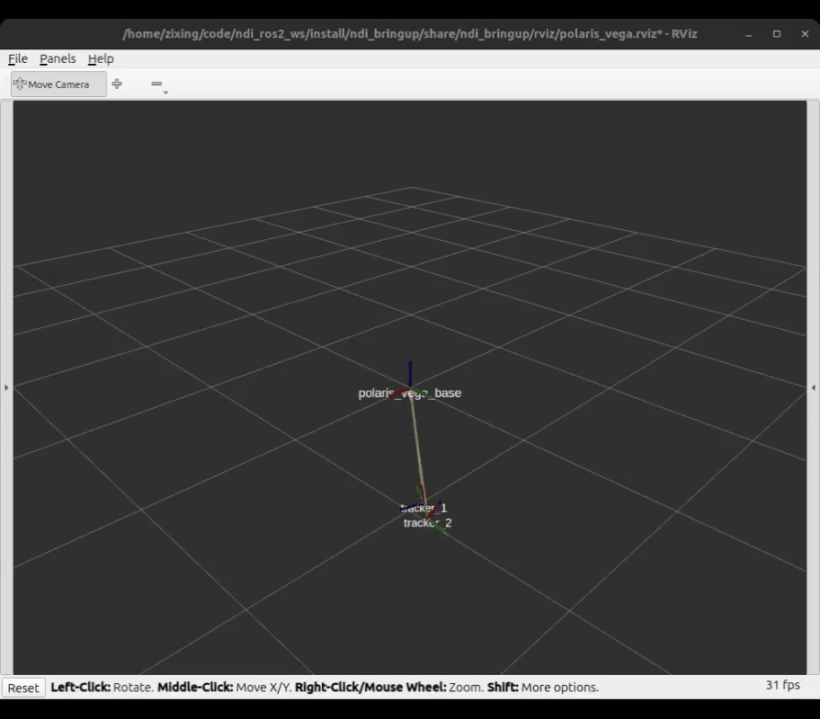

# NDI Optical Tracking Systems ROS 2 Driver
[](https://opensource.org/licenses/Apache-2.0)


*Disclaimer: This is a community-level repository and is not associated with NDI in any way.*

This repository offers a `ros2_control` driver for [Northern Digital Inc. (NDI)](https://www.ndigital.com/) manufactured optical tracking systems. This driver is a streamlined and updated version of [ICube-Robotics/ndisys_ros2](https://github.com/ICube-Robotics/ndisys_ros2). A comparison of this driver and ICube-Robotics' driver is shown below.

| Feature | This driver | ICube-Robotics' driver |
| --- | --- | --- |
| Compatible ROS2 distro | Jazzy (targets on Ubuntu 24.04) | Humble (targets on Ubuntu 22.04) |
| Data structure of trackers' pose | Uses the [pose_broadcaster](https://index.ros.org/p/pose_broadcaster/github-ros-controls-ros2_controllers/#jazzy) to publish trackers' pose in a standard ROS 2 [PoseStamped](https://docs.ros.org/en/noetic/api/geometry_msgs/html/msg/PoseStamped.html) format | Implements a rigid pose broadcaster to publish trackers' pose in a self-defined format |
|Broadcast tracking data to ROS 2 TF tree| Supported via pose_broadcaster | Supported via self-implemented broadcaster |
|Shipped with NDI Combined API (C++)| Yes (v1.9.7) | Yes |  


## Compatible devices
[NDI optical tracking systems](https://www.ndigital.com/optical-navigation-technology/optical-navigation-products/#).

## System requirements
ROS2 Jazzy on Linux (this driver is developed and tested on Ubuntu 24.04 LTS).

## Packages in this repository
- `ndi_bringup`: This package provides an example to bring up the driver for a NDI polaris vega system. Users may use this package as an reference to write their own bringup package for their application.
- `ndi_description`: This package contains the .rom file and `ros2_control` macros for describing the NDI optical tracking systems.
- `ndi_hardware`: This package contains the `ros2_control` hardware interface for NDI optical tracking systems. This package is built upon NDI's Combined API (C++) v1.9.7, which is shipped with this package at [ndi_hardware/external](https://github.com/zixingjiang/ndi_ros2_driver/tree/jazzy/ndi_hardware/external).

## Getting started
1. **Clone this repository in your ros2 workspace**. Taking `~/ndi_ros2_ws` as an example:
    ```bash
    mkdir -p ~/ndi_ros2_ws/src
    cd ~/ndi_ros2_ws/src
    git clone https://github.com/zixingjiang/ndi_ros2_driver.git
    ```
2. **Install dependencies**. 
   ```bash
   cd ~/ndi_ros2_ws
   rosdep update --rosdistro=$ROS_DISTRO
   sudo apt update
   rosdep install --from-paths ./ -i -y --rosdistro ${ROS_DISTRO}
   ```
3. **Build and source the workspace**. 
    ```bash
    colcon build 
    source install/setup.bash
    ```
4. **Connect to NDI optical tracking system and bringup the driver**. Connect the NDI system with your PC through Ethernet. The `ndi_bringup` package provides an example launch file to start a NDI polaris vega system with two trackers loaded (tracker_1: 8700339.rom; tracker_2: 8700340.rom):
   ```bash
   # Fill in your NDI system IP address in the following command
   ros2 launch ndi_bringup polaris_vega.launch.py \ 
     ip:=<your_ndi_ip> \
     gui:=true
   ```
   By setting `gui:=true` you can start a Rviz visualization of the tracking data.
   
   

5. **Access the data**. After starting the driver, you can access the tracking data through any of the following means: **ros2_control state interface**, **ROS 2 topics**, or **TF**. Note that the `ndi_bringup` package runs the `ros2_control` stack under the `ndi` namespace by default.

## Use this driver in your own project
### Write your own bringup package
If you want to use this driver in your own project, it is recommended to take `ndi_bringup` as an example and write your own bringup package. You may find [this guide](https://github.com/zixingjiang/ndi_ros2_driver/blob/jazzy/ndi_bringup/README.md) helpful. 

### Hand-eye calibration
If you want to use NDI devices with robots, you may need to do hand-eye calibration. Although this driver does not provide hand-eye calibration functionalities, there is a list of recommended hand-eye calibration packages that you can use with this driver:
- [easy_handeye2](https://github.com/marcoesposito1988/easy_handeye2): official ROS 2 port of the popular hand-eye calibration package [easy_handeye](https://github.com/IFL-CAMP/easy_handeye).
- [minimal_handeye_ros2](https://github.com/zixingjiang/minimal_handeye_ros2): my own hand-eye calibration package that is lightweight and easy to use.

## Acknowledgement
This driver is written with reference to [ICube-Robotics/ndisys_ros2](https://github.com/ICube-Robotics/ndisys_ros2).

## License
This repository is released under the [Apache 2.0 license](LICENSE).